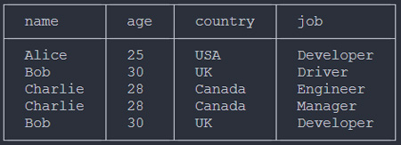
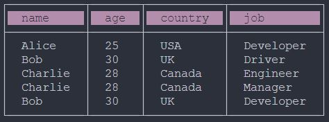
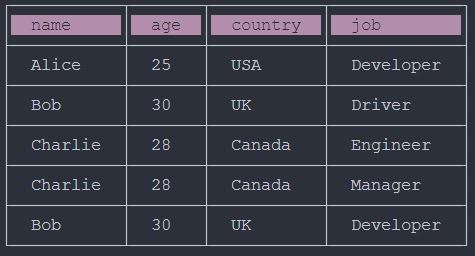
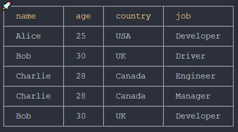
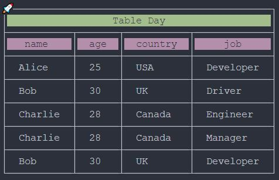

# react-native-console-table


>This package is designed to display an array of objects (with the same interface) as a table in the terminal.

## 🗃️ Installation
`npm i react-native-console-table`

### 📖 Usage

>⚠️ For correct table border display, ensure that a monospaced font is set for the terminal.\
>You can do this in VSCode: `File > Preferences > Settings > Font Family` enter `'Courier New', monospace'`.

```typescript
import { consoleTable } from 'react-native-console-table';

const dataMock: {name: string, age: number, country: string, job: string}[] = [
    { name: 'Alice', age: 25, country: 'USA', job: 'Developer' },
    { name: 'Bob', age: 30, country: 'UK', job: 'Driver' },
    { name: 'Charlie', age: 28, country: 'Canada', job: 'Engineer' },
    { name: 'Charlie', age: 28, country: 'Canada', job: 'Manager' },
    { name: 'Bob', age: 30, country: 'UK', job: 'Developer' }
];

consoleTable(dataMock);
or
consoleTable(dataMock, {...Props settings});
```
## Props settings

| Name | type | Description |
:---| :--- | :---
| selectionTitle | string \| undifined | Header highlight type selection |
| isShowLine | boolean | Table with or without data separation lines. |
| sing | string \| undifined | Icon selection for the table |
| title | string \| undifined | Table header
| selectionTitle | string \| undifined | Title highlight type selection

>By default, without a settings object.

```typescript
consoleTable(dataMock);
```



>Table display with highlighted header.

```typescript
consoleTable(dataMock, {selectionType: 'background_magenta'});
```



>Table display with highlighted header and data separation lines.

```typescript
consoleTable(dataMock, {selectionType: 'background_magenta', isShowLine: true});
```



>Table display with yellow headers, data separation lines, and an icon.

```typescript
consoleTable(dataMock, {selectionType: 'text_yellow', isShowLine: true, sing: 'rocket'});
```



>Table with highlighted header, highlighted top row, data separation lines, and an icon.

```typescript
consoleTable(dataMock, 
    {
        title: 'Table Day', 
        sing: 'rocket', 
        selectionTitle: 'background_green', 
        selectionHeader: 'background_magenta', 
        isShowLine: true
    }
);
```




