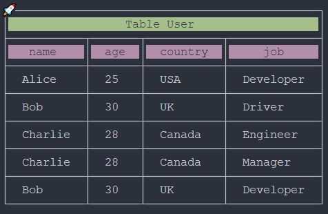
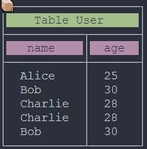

# react-native-console-table v0.2.9 

## What's Changed

>You can pass keys as an array to exclude specific columns from the table displayed in the console.

---

### Without filter

```typescript
consoleTable(dataMock, 
    {
        title: 'Table User', 
        sing: 'rocket', 
        selectionTitle: 'background_green', 
        selectionHeader: 'background_magenta', 
        isShowLine: true
    }
);
```



---

### With filter


```typescript
consoleTable(dataMock, 
    {
        title: 'Table User', 
        sing: 'box', 
        selectionTitle: 'background_green', 
        selectionHeader: 'background_magenta', 
        filter: ['job', 'country']
    }
);
```

